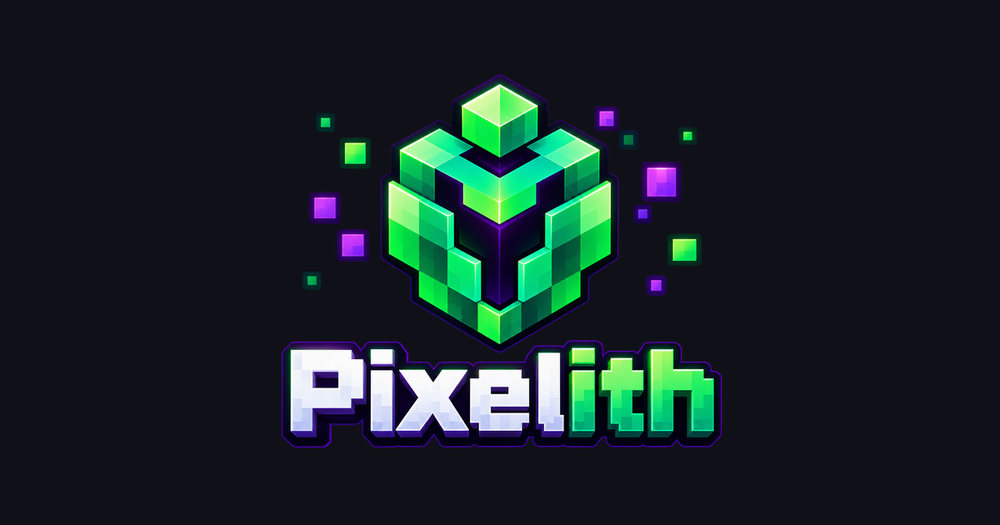

<p align="center"></p>

Static site (Astro) that's the home for the projects I build, experiment with and share, hosted on GitHub Pages.
It can host games, tools, creative experiments and Minecraft projects together, grouped into clear sections in the nav.
The files themselves are **not** stored here: each download is a link to a GitHub Release.

```
npm install
npm run dev      # http://localhost:4321
npm run build    # static site in dist/
```

## Adding a project

The **folder** decides the section:

| Section | File |
|---|---|
| Resource pack | `public/downloads/resourcepacks/<name>/<name>.md` |
| Data pack | `public/downloads/datapacks/<name>/<name>.md` |
| Plugin | `public/downloads/plugins/<name>/<name>.md` |
| Mod | `public/downloads/mods/<name>/<name>.md` |

1. Publish the file as a **GitHub Release** in the project's own repo (Releases → Draft a new release → tag, e.g. `v1.0.0` → attach the `.zip` / `.jar`).
2. Copy the asset's link (right-click the file on the release page → copy link). It looks like
   `https://github.com/<user>/<repo>/releases/download/v1.0.0/<file>.zip`
3. Copy an existing `.md` into the right folder above and put that link in `file:`.
4. `git add . && git commit -m "Add <name>" && git push` — GitHub Actions rebuilds the site.

## Icon (automatic — no path to type out)

Drop an image at `public/downloads/<type>/<slug>/icon.png` (or `.jpg`/`.jpeg`/`.webp`/`.gif`/`.svg`), beside the Markdown file, where
`<slug>` matches the `.md` file's name. It's picked up automatically — no `icon:` line needed in the frontmatter.

You can also add `header.png`, `header.webp`, `header.jpg`, `header.jpeg`, `header.gif` or `header.svg` in the same folder for the wide image on the project detail page. A frontmatter `header:` value may also be a full `https://` URL. If it is omitted, the project placeholder is used. The same image extensions and URL support apply to `icon:`.

Use `featured: true` (or the accepted alias `features: true`) to place a project in the Featured tools shelf.

You can set images explicitly in the Markdown frontmatter too:

```yaml
icon: icon.webp
header: header.webp
```

Both values may instead be full HTTPS image URLs. Local filenames are resolved from the project folder.
So adding a project is just: **the `.md` file + an icon file next to it in `public/`.**

You only need an `icon:` line if the image lives somewhere else (another folder, or a full `https://` URL) —
an explicit `icon:` always wins over the automatic one.

## Keeping older versions

Every version is one entry in `versions:`. Never delete old ones; add a new entry on top for each release.
The newest `date` becomes the big "Download" button; all entries appear in the project's **Versions** tab.

```yaml
versions:
  - version: 1.1.0
    mc: ["1.21.5"]
    file: https://github.com/<user>/<repo>/releases/download/v1.1.0/pack-1.1.0.zip
    date: 2026-10-01
    changelog: New GUI textures.
  - version: 1.0.0
    mc: ["1.21.4"]
    file: https://github.com/<user>/<repo>/releases/download/v1.0.0/pack-1.0.0.zip
    date: 2026-09-01
    changelog: Initial release.
```

Old GitHub Releases stay available as long as you don't delete them, so old links keep working.
`mc` can be left out entirely for a non-Minecraft download — it's optional.

Filter options (categories, loaders, resolutions) are in `src/data/site.ts`.

## Deploying

Repo → Settings → Pages → Source: **GitHub Actions**. `.github/workflows/deploy.yml` sets the base path from the repo name.

## All-in-one projects (e.g. resource pack + data pack)

Some downloads are several kinds at once. Keep the file in its **main** folder and list the other sections with `alsoIn`:

```yaml
# public/downloads/resourcepacks/my-combo/my-combo.md
title: My Combo
alsoIn: [datapacks]
```

It then appears in **both** the Resource Packs and Data Packs sections (one project page, under its main folder), with a yellow dot on its icon, an "All-in-one" tag on the card, and a yellow warning on the page telling people to install it in both folders.

## Adding a new group later (beyond Minecraft)

The nav is built from `groups` + `types` in `src/data/site.ts`: each type belongs to a `group`, and Header
renders one dropdown per group automatically. To open up a new top-level section (e.g. "Apps"):

1. Add a group to `groups` in `src/data/site.ts`.
2. Add one or more entries to `types` with that `group` key (and their own categories/loaders as needed).
3. Add a matching folder under `public/downloads/` and place `<name>.md` plus `icon.png` inside it.

No other wiring needed — the nav, filters and project pages pick it up on their own.
